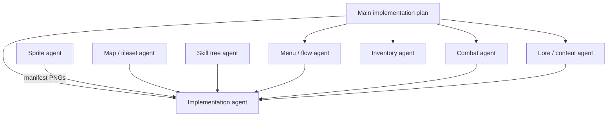

# Agent Skills Required — Umbral Explorers: Relics of Grimvale

**Purpose:** Master index of which Cursor/Codex skills and project docs each agent role must use.  
**Master architecture:** [Main_ChatGPT-Godot_RPG_Implementation_Plan.md](../Main_ChatGPT-Godot_RPG_Implementation_Plan.md)

Enable skills in the agent profile before starting work. Read the linked doc for that role first.

---

## Agent roles overview

| Role | Primary doc | Project Cursor skill | Generates art? | Edits Godot code? |
|------|-------------|----------------------|----------------|-------------------|
| **Implementation / bible** | Main plan + domain guides below | — (use `godogen` only when user asks for full-game gen) | No | Yes |
| **External sprite** | [external_sprite_agent_instructions.md](external_sprite_agent_instructions.md) | `.cursor/skills/monster-sprite-agent` | Yes (PNG) | No (manifest only) |
| **Maps / tileset** | [custom_tileset_object_kit_instructions.md](custom_tileset_object_kit_instructions.md) | — | Optional placeholders | Yes (scenes/tiles) |
| **Skill tree UI** | [RPG_Skill_Tree_Agent_Guide.md](RPG_Skill_Tree_Agent_Guide.md) | — | UI chrome optional | Yes |
| **Monster systems** | [monster_design_bible.md](monster_design_bible.md) | — | No | Yes |
| **Lore / content** | [Grimvale_Lore_World_Tone_Foundation.md](Grimvale_Lore_World_Tone_Foundation.md) | — | No | Optional |
| **Menu / game flow** | [Menu_Game_Flow_Settings_Agent_Instructions.md](Menu_Game_Flow_Settings_Agent_Instructions.md) | — | UI assets optional | Yes |
| **Combat / abilities** | [Combat_Ability_Logic_Feedback_Agent_Instructions.md](Combat_Ability_Logic_Feedback_Agent_Instructions.md) | — | No | Yes |
| **Inventory / equipment / loot** | [Inventory_Equipment_Itemization_Loot_Agent_Instructions.md](Inventory_Equipment_Itemization_Loot_Agent_Instructions.md) | — | Item icons optional | Yes |

---

## 1. Implementation agent (default Godot builder)

**When:** Phases in Main plan, combat, saves, HUD, quests, wiring delivered art.

### Required skills

| Skill | Why |
|-------|-----|
| **godot-master** | Godot 4.x architecture and anti-patterns |
| **godot-gdscript-mastery** | Typed GDScript, signals, scene conventions |
| **godot-project-foundations** | Folders, naming, `res://` paths |
| **godot-composition** or **godot-composition-apps** | Components on player/monsters |
| **godot-signal-architecture** | Autoloads, event flow |
| **godot-scene-management** | Map load, transitions |
| **godot-save-load-systems** | Character-ID autosave/index migration and atomic persistence |
| **godot-combat-system** | Hitbox/hurtbox, real-time damage |
| **godot-characterbody-2d** | Top-down movement |
| **godot-input-handling** | InputMap, mobile + desktop |
| **godot-genre-action-rpg** | ARPG loops, loot, abilities tone |

### Required docs (domain overrides)

| Topic | Doc |
|-------|-----|
| Architecture & phases | Main plan |
| Monsters (code/data) | [monster_design_bible.md](monster_design_bible.md) §0, §20–22 |
| Monster art import | [sprite_deliverables/manifest.json](sprite_deliverables/manifest.json) |
| Maps & collision | [custom_tileset_object_kit_instructions.md](custom_tileset_object_kit_instructions.md) |
| Skill tree | [RPG_Skill_Tree_Agent_Guide.md](RPG_Skill_Tree_Agent_Guide.md) |
| Lore, world tone, naming | [Grimvale_Lore_World_Tone_Foundation.md](Grimvale_Lore_World_Tone_Foundation.md) |
| Menu, save flow, settings | [Menu_Game_Flow_Settings_Agent_Instructions.md](Menu_Game_Flow_Settings_Agent_Instructions.md) |
| Combat, abilities, feedback | [Combat_Ability_Logic_Feedback_Agent_Instructions.md](Combat_Ability_Logic_Feedback_Agent_Instructions.md) |
| Inventory, equipment, loot | [Inventory_Equipment_Itemization_Loot_Agent_Instructions.md](Inventory_Equipment_Itemization_Loot_Agent_Instructions.md) |

### Must not

- Generate final monster sprite sheets or codex portraits (sprite agent).
- Implement conditional rare spawn until requested (monster bible §24).
- Replace core systems wholesale; patch additively per Main plan.

### Strongly recommended

| Skill | Use |
|-------|-----|
| **godot-ability-system** | Cleave, Charge, cooldowns |
| **godot-quest-system** | Quest JSON and manager |
| **godot-inventory-system** | Items, equipment |
| **godot-ui-containers** | HUD, menus |
| **godot-ui-theming** | Blue/gold guild menus and darker readable Umbral panels |
| **godot-2d-physics** | Collision layers |
| **godot-tilemap-mastery** | `TileMapLayer` maps |
| **godot-rpg-stats** | STR/DEX/INT/VIT/LCK |
| **godot-debugging-profiling** | Validation in editor |

---

## 2. External sprite agent

**When:** Battle sheets, codex portraits, affinity icons.

**Detail:** [external_sprite_agent_skills.md](external_sprite_agent_skills.md)

### Required skills

| Skill | Why |
|-------|-----|
| **monster-sprite-agent** (project) | Paths, manifest, handoff rules |
| **godot-2d-animation** | Sheet rows; Godot names `idle`, `move`, `attack`, … |
| **godot-project-foundations** | File naming under `assets/sprites/monsters/` |
| **godot-resource-data-patterns** | `monster_id` ↔ manifest fields |

### Recommended

**godot-master**, **godot-ui-theming**, **godot-genre-action-rpg**

### Avoid

**godogen**, **godot-combat-system**, **godot-scene-management**, **godot-builder**

### Tools (outside skills)

Aseprite / LibreSprite / Pixelorama for grid cleanup; image models for first pass only.

---

## 3. Maps / tileset agent

**When:** Custom `TileMapLayer` kit, Grimvale routes, portal-linked dungeons, spawn layout, and readable Umbral biomes.

### Required skills

| Skill | Why |
|-------|-----|
| **godot-tilemap-mastery** | Layers, collision, custom data |
| **godot-2d-physics** | Layers 1–10, blockers |
| **godot-project-foundations** | `assets/tilesets/custom/`, map scenes |
| **godot-scene-management** | Map scene contract from Main plan |

### Required docs

[custom_tileset_object_kit_instructions.md](custom_tileset_object_kit_instructions.md), [Grimvale_Lore_World_Tone_Foundation.md](Grimvale_Lore_World_Tone_Foundation.md), Main plan §6 (maps)

### Recommended

| Skill | Why |
|-------|-----|
| **godot-genre-action-rpg** | Zone escalation, hubs |
| **godot-genre-metroidvania** | Route + back/next portals |
| **godot-quest-system** | Per-map quest hooks |
| **godot-game-loop-waves** | Encounter tables (not wave TD) |

### Avoid

Generating monster battle art; use sprite pipeline.

---

## 4. Skill tree agent

**When:** Warrior 37-node tree, `SkillTreeManager`, mockup UI (§2.1 of skill tree guide).

### Required skills

| Skill | Why |
|-------|-----|
| **godot-ability-system** | Cleave/Charge unlocks, modifiers |
| **godot-resource-data-patterns** | `warrior_skill_tree.json`, node graph |
| **godot-ui-containers** | Tree canvas + detail sidebar layout |
| **godot-ui-theming** | Gold panels, branch rings, UNLOCK button |
| **godot-ui-rich-text** | Effect bullets in detail panel |
| **godot-signal-architecture** | Unlock/select signals |
| **godot-save-load-systems** | `unlocked_skill_nodes` |
| **godot-rpg-stats** | STR/VIT/LCK node effects |
| **godot-genre-action-rpg** | Keystones, build identity |

### Required docs

[RPG_Skill_Tree_Agent_Guide.md](RPG_Skill_Tree_Agent_Guide.md) (UI §2.1 mockup is mandatory for presentation)

### Recommended

**godot-master**, **godot-gdscript-mastery**, **godot-tweening** (selection glow)

### Avoid

**godogen** for full UI regen; refactor existing `skill_tree_ui` additively.

---

## 5. Monster Codex UI agent (future / partial)

**When:** Menu bestiary — portraits, family, affinity, description, weaknesses.

### Required skills

| Skill | Why |
|-------|-----|
| **godot-ui-containers** | Book layout, entry grid |
| **godot-ui-theming** | Parchment/dark fantasy |
| **godot-ui-rich-text** | Descriptions |
| **godot-save-load-systems** | Discovered monsters |
| **godot-resource-data-patterns** | `monsters.json` + `codex_portrait` |

### Required docs

[monster_design_bible.md](monster_design_bible.md) §23, sprite manifest `codex_portrait` + `description`

### Depends on

Sprite agent codex portraits; implementation agent data fields.

---

## 6. Menu, Game Flow, And Settings Agent

**When:** Title flow, character start, Continue/autosave metadata, top menu, pause, settings, and death UI.

### Required skills

**godot-ui-containers**, **godot-ui-theming**, **godot-input-handling**, **godot-scene-management**, **godot-save-load-systems**, **godot-signal-architecture**

### Required docs

[Menu_Game_Flow_Settings_Agent_Instructions.md](Menu_Game_Flow_Settings_Agent_Instructions.md), Main plan Phase 14-15

### Must preserve

Phase 15A-15D order, standalone Inventory, canonical Character/Skill Tree, separate NPC quest dialogue and Quest Journal, HUD ownership, one character-ID autosave/index, and independent `SettingsManager` persistence.

---

## 7. Combat, Ability, And Feedback Agent

**When:** Damage calculation, hitbox/hurtbox flow, abilities, targeting, feedback, potions, death/reset contracts.

### Required skills

**godot-combat-system**, **godot-ability-system**, **godot-2d-physics**, **godot-rpg-stats**, **godot-audio-systems**, **godot-performance-optimization**

### Required docs

[Combat_Ability_Logic_Feedback_Agent_Instructions.md](Combat_Ability_Logic_Feedback_Agent_Instructions.md), Main plan Phase 4-7 and 16

### Must preserve

One stateless `DamageCalculator`, one canonical package, one feedback owner, free basic attacks, Warrior v1 scope, mobile feedback caps, approved v1 damage types, and no screen shake or hit-stop in v1.

---

## 8. Lore And Content Agent

**When:** Maps, quests, NPCs, relics, regions, bosses, item names, and narrative copy.

### Required docs

[Grimvale_Lore_World_Tone_Foundation.md](Grimvale_Lore_World_Tone_Foundation.md), plus the owning gameplay domain doc.

### Must preserve

Grimvale country/island scale, heroic mystery, the Fallen/relic relationship, town portals, and multi-map dungeon routes.

---

## 9. Inventory, Equipment, Itemization, And Loot Agent

**When:** Inventory/equipment migration, generated item instances, loot tables, shops, potion transactions, and standalone inventory UI.

### Required skills

**godot-inventory-system**, **godot-resource-data-patterns**, **godot-save-load-systems**, **godot-ui-containers**, **godot-signal-architecture**, **godot-rpg-stats**

### Required docs

[Inventory_Equipment_Itemization_Loot_Agent_Instructions.md](Inventory_Equipment_Itemization_Loot_Agent_Instructions.md), Main plan Phases 9, 14, and 15B

### Must preserve

`Inventory` ownership, standalone Inventory UI, character autosave payload boundaries, independent settings storage, exact item instances, potion success/failure, and central `DamageCalculator` consumption of combat stats.

---

## 10. Optional / phase-specific skills

| Skill | Use when |
|-------|----------|
| **godot-audio-systems** | Phase 16 SFX/music |
| **godot-export-builds** | Release builds |
| **godot-platform-mobile** | Touch HUD polish |
| **godot-testing-patterns** | GUT tests if requested |
| **godot-multiplayer-networking** | Not v1 — skip |
| **godot-builder** | CI/headless only |

---

## 11. Project skills (this repo)

| Path | Role |
|------|------|
| `.cursor/skills/monster-sprite-agent/SKILL.md` | External sprite agent entry point |
| `AGENTS.md` | Quick routing for Codex |

---

## 12. Quick pick by task

| User says… | Role | Open doc | Skills (minimum) |
|------------|------|----------|------------------|
| “Draw slime sprites” | Sprite | external_sprite_agent_instructions | monster-sprite-agent, godot-2d-animation |
| “Wire monsters.json” | Implementation | monster_design_bible §0 | godot-resource-data-patterns, godot-gdscript-mastery |
| “Build swamp map” | Tileset | custom_tileset_object_kit_instructions | godot-tilemap-mastery, godot-2d-physics |
| “Warrior skill tree UI” | Skill tree | RPG_Skill_Tree_Agent_Guide | godot-ui-theming, godot-ability-system |
| “Monster bestiary menu” | Codex UI | monster_design_bible §23 | godot-ui-containers, godot-ui-theming |
| “Build map encounters” | Implementation | Main plan + tileset spawn rules | godot-game-loop-waves, godot-combat-system |
| “Build the title/settings flow” | Menu | Menu_Game_Flow_Settings_Agent_Instructions | godot-ui-containers, godot-save-load-systems |
| “Refactor combat damage” | Combat | Combat_Ability_Logic_Feedback_Agent_Instructions | godot-combat-system, godot-ability-system |
| “Write a Grimvale dungeon quest” | Lore/content | Grimvale_Lore_World_Tone_Foundation | godot-quest-system, godot-resource-data-patterns |
| “Update inventory or loot” | Inventory | Inventory_Equipment_Itemization_Loot_Agent_Instructions | godot-inventory-system, godot-save-load-systems |

---

## 13. Handoff checklist (cross-agent)

- [ ] Sprite agent updated `docs/sprite_deliverables/manifest.json`
- [ ] Implementation agent verified PNGs on disk before changing `sprite` paths
- [ ] Maps use `TileMapLayer` contract, not flat background-only blockers (tileset doc)
- [ ] Monster animations use **`move`**, not `walk`
- [ ] Skill tree UI matches mockup §2.1 before adding Ranger/Mage trees
- [ ] Skill tree grants one point per level and uses the canonical Warrior tree source
- [ ] Menu work uses the character-ID autosave/index contract and independent settings file
- [ ] Combat work uses one damage calculator/package/feedback owner and no v1 screen shake or hit-stop
- [ ] Inventory work remains standalone, stays inside the character payload, and leaves global settings ownership untouched
- [ ] Content work follows Grimvale lore, naming, portal, dungeon, relic, and tone rules
- [ ] Main plan phase commit only after Godot validates
