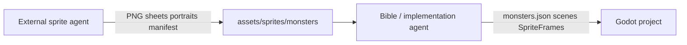

# Skills for the External Monster Sprite Agent

**Project:** Umbral Explorers: Relics of Grimvale  

Use this list when configuring a **dedicated sprite / art agent** (separate from the Godot implementation agent). Enable these skills in Cursor, Codex, or your external image pipeline so the agent stays in its lane.

**Primary instruction doc:** [external_sprite_agent_instructions.md](external_sprite_agent_instructions.md)  
**Master skills index:** [agent_skills_required.md](agent_skills_required.md) §2  
**Design rules:** [monster_design_bible.md](monster_design_bible.md) (art sections only — do not edit Godot code)  
**World tone:** [Grimvale_Lore_World_Tone_Foundation.md](Grimvale_Lore_World_Tone_Foundation.md)  
**Project skill (Cursor):** `.cursor/skills/monster-sprite-agent/SKILL.md`

---

## Required skills (enable these)

| Skill | Path / name | Why the sprite agent needs it |
|-------|-------------|-------------------------------|
| **Monster sprite agent (project)** | `.cursor/skills/monster-sprite-agent` | Routes to deliverable paths, naming, and handoff manifest |
| **Godot 2D animation** | `godot-2d-animation` | Sprite sheet rows, `AnimatedSprite2D` animation names (`idle`, `move`, …), frame alignment |
| **Godot project foundations** | `godot-project-foundations` | `snake_case` files, `res://assets/sprites/monsters/` layout |
| **Godot resource / data patterns** | `godot-resource-data-patterns` | Maps art to `monster_id` and `monsters.json` fields without inventing stats |

---

## Strongly recommended skills

| Skill | Why |
|-------|-----|
| **Godot master** | Consistent Godot 4.x terminology and anti-patterns |
| **Godot GDScript mastery** | Only if the agent also writes import helpers or `.tres` builders — optional |
| **Godot UI theming** | Codex portrait framing and consistency with the blue/gold guild identity |
| **Godot genre action RPG** | Elite/boss readability and restrained ARPG feedback |

---

## Reference-only (read sections, do not implement game code)

| Doc / skill area | Use for |
|------------------|---------|
| [monster_design_bible.md](monster_design_bible.md) §1–16, §24 | Families, affinities, sizes, tone |
| [custom_tileset_object_kit_instructions.md](custom_tileset_object_kit_instructions.md) | World palette contrast — sprites slightly brighter than terrain |
| [Grimvale_Lore_World_Tone_Foundation.md](Grimvale_Lore_World_Tone_Foundation.md) | Heroic mystery, Fallen relic identity, and Umbral escalation |
| Codex style mockup | Portrait style target (see instructions doc) |

---

## Skills the sprite agent must NOT rely on

These belong to the **implementation / bible agent**, not the sprite agent:

| Avoid | Reason |
|-------|--------|
| `godogen` | Whole-game generation; bypasses art pipeline |
| `godot-combat-system`, `godot-game-loop-waves` | Spawning and combat logic |
| `godot-scene-management`, `godot-save-load-systems` | Codex UI implementation |
| `godot-builder` | CI / headless builds |

---

## Tooling outside Cursor skills

The sprite agent may use external tools **only for art output**:

| Tool | Role |
|------|------|
| **Aseprite / LibreSprite / Pixelorama** | Pixel cleanup, true grids, transparency |
| **Image model + manual fix** | First pass from prompts in [external_sprite_agent_instructions.md](external_sprite_agent_instructions.md) |
| **Python PIL** | Placeholder blobs only — not final codex quality |

Do **not** expect generic `GenerateImage` alone to produce shippable 4×6 animation grids without human or Aseprite pass.

---

## Agent split (two roles)

| Role | Reads | Writes |
|------|-------|--------|
| **Sprite agent** | `external_sprite_agent_instructions.md`, bible art rules | PNGs, optional affinity icons, `sprite_deliverables/manifest.json` |
| **Implementation agent** | `monster_design_bible.md` §0, deliverables manifest | `monsters.json`, scenes, `.tres`, codex UI — **uses existing PNGs** |

---

## Checklist before handoff to implementation agent

- [ ] Battle sheet PNG per monster ID (transparent, grid documented)
- [ ] Codex portrait PNG per monster ID (if roster entry is player-visible in codex)
- [ ] Animation row names match Godot: `idle`, `move`, `attack`, `hit`, `death`, `spawn`
- [ ] Files saved under `assets/sprites/monsters/` with naming from instructions doc
- [ ] `docs/sprite_deliverables/manifest.json` updated
- [ ] No edits to `scripts/`, `scenes/`, or `data/` unless explicitly asked
