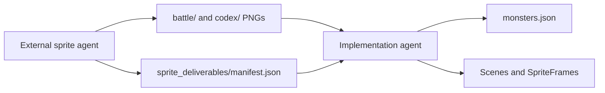

# Monster Design Bible

**Project:** Umbral Explorers: Relics of Grimvale (`godot-rpg`)  
**Status:** Active v1.0 — send this file to art, sprite, and implementation agents  
**Style:** Broad-audience pixel readability, heroic mystery, and darker Umbral escalation on elites/bosses

**Related project docs:** [Main_ChatGPT-Godot_RPG_Implementation_Plan.md](../Main_ChatGPT-Godot_RPG_Implementation_Plan.md), [Grimvale_Lore_World_Tone_Foundation.md](Grimvale_Lore_World_Tone_Foundation.md), [Combat_Ability_Logic_Feedback_Agent_Instructions.md](Combat_Ability_Logic_Feedback_Agent_Instructions.md), [custom_tileset_object_kit_instructions.md](custom_tileset_object_kit_instructions.md), [agent_skills_required.md](agent_skills_required.md)

**Art pipeline (sprite agent):** [external_sprite_agent_instructions.md](external_sprite_agent_instructions.md), [external_sprite_agent_skills.md](external_sprite_agent_skills.md), [sprite_deliverables/manifest.json](sprite_deliverables/manifest.json)

---

## Master Plan Integration Locks

- Monsters must fit Grimvale's heroic-mystery tone and the lore categories of natural, corrupted, reanimated, relic-bound, or Umbral-born threats.
- Early monsters remain readable and broad-audience safe. Darkness escalates in Umbral regions without gore or horror-first presentation.
- Monster attacks use hitboxes/telegraphs, not unconditional body-contact damage as the primary model.
- All monster damage routes through the canonical `DamageCalculator` and damage package.
- Damage numbers and hit effects route through the single combat feedback owner; monster scripts must not spawn parallel feedback.
- V1 runtime damage types are `physical`, `spell`, `poison`, and `true`; affinity labels remain visual/content metadata unless a reviewed combat consumer exists.
- The Monster Codex is future work and must hook into the HUD-owned menu flow without replacing the global Quest Journal.

---

## 0. Instructions for Agents (read first)

### Two agents — do not mix roles

| Agent | Document | Creates art? | Edits Godot? |
|-------|----------|--------------|--------------|
| **External sprite agent** | [external_sprite_agent_instructions.md](external_sprite_agent_instructions.md) | **Yes** — PNG sheets + codex portraits | **No** (only `sprite_deliverables/manifest.json`) |
| **Implementation / bible agent** | This file §0 checklist | **No** — uses delivered PNGs | **Yes** |

When art and code conflict, **implementation agent uses sprite deliverables** from `docs/sprite_deliverables/manifest.json`, not newly generated art.

---

### Implementation agent — you must apply to the codebase

1. **Import sprites from manifest** — read [sprite_deliverables/manifest.json](sprite_deliverables/manifest.json). Copy `battle_sheet` → `sprite` in `monsters.json`. Copy `codex_portrait`, `description`, `codex_index`, `weaknesses`, `resists` when building the Monster Codex UI. If PNGs are missing, keep legacy placeholders and do not invent replacement art.
2. **`res://data/monsters/monsters.json`** — every entry includes `family`, `size_class`, `affinities`, `sprite`, optional `sprite_frames`, optional `codex_portrait`, `description`. See §20–21.
3. **Godot animation name `move`** — all monster `SpriteFrames`, scenes, and scripts use **`move`** for locomotion, never `walk`. Rename in `monster_base.gd`, monster scenes, and `*_frames.tres` if needed.
4. **Encounters** — `res://data/encounters/encounters.json` with `weight` and `max_alive` (§13).

### Implementation agent — do not

- Generate monster sprite sheets or codex portraits (sprite agent’s job).
- Change `battle_sheet` paths to random assets not listed in the manifest.
- Implement conditional rare spawn (§24).

### Do not break without asking

- Monster **IDs** (`slime_green`, `bat`, …).
- Encounter table IDs used by live maps.
- Player `walk` animations (monsters only use `move`).

---

## 1. Core Monster Direction

Monsters belong in a 2D top-down action RPG that mixes:

- **Pokémon-like readability:** clear silhouettes, compact sprites, recognizable families.
- **Zelda-like combat read:** readable at zoom, distinct motion, maps with open arenas for real-time fight (~80px detect / ~20px attack in `monster_base.gd`).
- **Umbral escalation:** corruption, skulls, glowing eyes, cursed energy, relic marks, and stronger shadow influence on elites and bosses without realistic gore.

> **Dangerous but readable pixel-art monsters.**

Normals stay broad-audience friendly. Elites and bosses may be darker and more grotesque, still stylized pixel fantasy.

**Colour hierarchy:** darkest = world tiles → monster body → brightest = eyes, weapons, magic VFX.

---

## 2. Audience and Tone Rules

**Allowed:** skulls, bones, glowing eyes, cursed marks, shadow smoke, cracked bodies, mutated limbs, torn cloth, fangs/claws, magical corruption.

**Avoid:** realistic gore, excessive blood, exposed organs, 18+ horror, clutter that fails at small pixel size.

---

## 3. Pixel-Art Style Rules

1. Top-down / three-quarter RPG view.  
2. Readable at gameplay zoom.  
3. Clear outer silhouette.  
4. Defined details grouped into shapes — not noise.  
5. Strong contrast: body, eyes, claws/weapons, magic.  
6. Limited palette per monster.  
7. Clean pixel clusters; avoid smooth gradients.  
8. Families recognizable without animation.

Distinguish at a glance: slime, bat, ghost, skeleton, zombie, worm, lizard, goblin, elemental spirit, beast.

---

## 4. Sprite Size Rules

| Role | Frame size | `size_class` in JSON |
|------|------------|----------------------|
| Small | 48×48 | `small` |
| Normal | 64×64 | `normal` |
| Elite / large | 96×96 | `elite` |
| Boss | 128×128+ | `boss` |

Legacy embedded sheets may be smaller until replaced; new art targets the table above.

### Stable body scale across animations

The frame canvas size does not define the apparent monster size. Every monster also
needs one stable **body-core scale** across animation rows.

- Use the median body-core bounds across all four `idle` frames as the reference.
- `idle`, `move`, and `hit`: body-core width and height stay within **+/-8%**.
- `attack`, `cast`, `special`, and `enrage`: body-core width and height stay within
  **+/-10%**.
- `death` and `spawn` are the only automatic scale exemptions.
- Weapons, wings, extended limbs, projectiles, detached particles, and VFX do not
  count as body-core size. They may expand the outer silhouette during an action.
- Never uniformly shrink or enlarge the complete monster to fit an animation.
  Larger action silhouettes must come from pose, weapon reach, limbs, or effects.

Family-specific body cores:

- Humanoids / skeletons: head, torso, shoulders, pelvis, and stable limb thickness.
- Beasts: head, torso mass, shoulder/hip mass, and planted body height.
- Bats: head and torso; wing span may change through the flap.
- Slimes: eye/core dimensions stay within **+/-8%** and opaque body-core area stays
  within **+/-12%**. Squash/stretch may change width and height when perceived
  volume remains stable; a flatter slime must become wider rather than smaller.

Anchor and cell limits:

- Root/body anchor variance: at most 1 px in 48/64 px frames, 2 px in 96 px
  frames, and 3 px in 128 px frames.
- Outer alpha silhouette may occupy at most 92% of either cell dimension.
- Keep at least 2 transparent pixels between artwork and every cell edge.
- Effects that need more room belong in separate Godot VFX instead of being
  clipped or forcing the monster body to shrink.

---

## 5. Animation Rules

### Required Godot animation names (monsters)

| Animation | Required for | Notes |
|-----------|--------------|-------|
| `idle` | all | |
| `move` | all | **Locomotion — use `move`, never `walk`** |
| `attack` | all | |
| `hit` | all | Wire when art exists |
| `death` | all | |
| `spawn` | all | Wire when art exists |
| `cast` | elite, boss | |
| `special` | elite, boss | |
| `enrage` | boss | optional |

`monster_base.gd` state flow: idle → wander uses **`move`**; chase uses **`move`**; attack uses **`attack`**; death uses **`death`**.

### Target sprite sheet layout

```text
4 columns × 6 rows (normal monsters)
Row 1: idle
Row 2: move
Row 3: attack
Row 4: hit
Row 5: death
Row 6: spawn
```

Bosses may add rows: cast, special, enrage.

### Personality by family

- Slimes: bounce, squash, stretch.  
- Bats: flap, dart.  
- Ghosts: float, flicker.  
- Skeletons: stiff rattle, swing.  
- Zombies: stumble, lunge.  
- Worms: crawl, burrow, snap.  
- Lizards: scuttle, bite.  
- Goblins: hop, stab.  
- Elemental spirits: pulse, drift.  
- Beasts: stalk, pounce.

---

## 6. Monster Behaviour Direction

Default AI (`monster_base.gd`):

1. Idle or wander.  
2. Detect player.  
3. Chase.  
4. Attack in range.  
5. Stop when player leaves detection.  
6. Limit map-wide swarms via per-type `max_alive` in encounter JSON.

Bosses may later get phases, summons, or arena mechanics.

Combat integration:

- Use explicit attack hitboxes and telegraph timing.
- Do not treat player overlap as a universal contact-damage attack.
- Build the canonical damage package and submit it to `DamageCalculator`.
- Emit feedback requests to the shared combat feedback owner instead of creating local damage-number or hit-effect paths.

---

## 7. Monster Families

Each family needs: silhouette, visual identifier, readable motion, variant room, possible boss.

| Family | Silhouette | Identifier | Role |
|--------|------------|------------|------|
| Slime | round/blob | core, eye, bubbles | starter, variants |
| Bat | wide wings | ears, wings | fast weak flyer |
| Ghost | teardrop float | torn body, glowing eyes | eerie ranged |
| Skeleton | thin angular | skull, bones | undead |
| Zombie | hunched | dull eyes, slump | slow tank |
| Worm | long low | segments | cave burrower |
| Lizard | low crawl | tail, head | dungeon melee |
| Goblin | small hunched | ears, weapon | weak humanoid |
| Elemental spirit | floating orb | aura/core | magic ranged |
| Beast | four-legged | claws, bulk | chaser, elite |

---

## 8. Naming Rules

- **Display names:** early simple (Green Slime), mid fantasy (Toxic Slime), late dark (Gravebound Skeleton).  
- **Data IDs:** stable snake_case — `slime_green`, `bat`, `skeleton` (do not rename casually).  
- **Boss names:** tied to family — King Slime, Bone Knight, Bat Lord.

---

## 9. Families and Variants

```text
Slime: slime_green → slime_blue → poison variants → king slime boss
Bat: bat → cave bat → gloom bat → bat lord
Skeleton: skeleton → archer → bone knight boss
```

Same family may appear on multiple maps with different weights.

---

## 10. Affinities

Affinity = monster’s **own** type identity (not the same as player resistance charts).

- **Maximum two** affinities per monster.  
- Values in JSON: lowercase strings.

| Affinity | Visual cue |
|----------|------------|
| neutral | none / grey |
| fire | ember glow |
| water | blue shimmer |
| poison | green bubbles |
| lightning | purple sparks |
| ice | frost |
| shadow | dark smoke |
| undead | bone + blue-green glow |
| armored | plate/shield |

**Skipped for now:** earth, nature.

---

## 11. Affinity Display

Primary: **small icon near HP bar** (UI may not exist yet — add when implementing HUD).

Optional subtle cues on the sprite. Do not clutter the sprite; icon carries gameplay clarity.

---

## 12. Two-Affinity Examples

| Monster | Affinities |
|---------|------------|
| slime_green | neutral |
| slime_blue | water |
| skeleton | undead |
| dark_knight | undead, armored |

Avoid triple combos early.

---

## 13. Introduction Pacing and Spawning (implemented)

Start simple: **slime_green** + **bat**, then add **slime_blue**, **skeleton**, elites, bosses.

**Implemented today** — `res://data/encounters/encounters.json`:

```json
"ambient_spawns": [
  { "monster_id": "slime_green", "weight": 70, "max_alive": 4 }
],
"boss": { "monster_id": "skeleton", "spawn_point": "BossSpawnPoint" }
```

- Town hubs: empty `ambient_spawns` (e.g. `town_safe`).  
- Monster maps: ~3–4 types + 1 boss near route end.  
- Overlap across maps is fine.

---

## 14. Map and Biome Rules

- Hubs: no ambient monsters.  
- Routes: back portal → path → combat pockets → boss/elite → next portal (see tileset doc).  
- Dungeons: can restrict to undead, poison, armored families.  
- Prefer **family-themed bosses** over reusing a normal variant as boss when art allows.

---

## 15. Early Roster (design targets)

| Map phase | Monsters |
|-----------|----------|
| Forest / fields | slime_green, bat |
| + rare | slime_blue |
| Ruins / cave | + skeleton |
| Marsh | swamp_monster, poison variants |
| Finale regions | dark_knight or bone knight boss |

---

## 16. Boss Rules

Connected to a family when possible. Clear silhouette, readable `move`/`attack`, max two affinities, no gore.

---

## 17. Art production (sprite agent only)

**Do not generate sprites in this bible agent.**

All prompts, codex portrait style, battle sheet grids, and per-monster briefs live in:

- [external_sprite_agent_instructions.md](external_sprite_agent_instructions.md)
- [external_sprite_agent_skills.md](external_sprite_agent_skills.md)

Handoff file: [sprite_deliverables/manifest.json](sprite_deliverables/manifest.json)

After the sprite agent delivers PNGs, this agent imports paths into `monsters.json` and wires `SpriteFrames` / scenes.

---

## 18. Asset pipeline



1. Sprite agent produces `battle/{id}_sheet.png` and `codex/{id}_portrait.png`.  
2. Sprite agent updates manifest (`animations_present` when complete).  
3. Implementation agent sets `monsters.json` `sprite` from `battle_sheet`.  
4. Implementation agent sets `codex_portrait` and `description` from manifest for Monster Codex UI.  
5. Legacy root-level sheets (e.g. `bat_spritesheet.png`) remain until migrated.

---

## 19. Project Paths

```text
res://assets/sprites/monsters/battle/     # Sprite agent battle sheets
res://assets/sprites/monsters/codex/      # Sprite agent codex portraits
res://assets/sprites/monsters/icons/      # Affinity icons for UI
res://assets/sprites/monsters/            # Legacy sheets + *_frames.tres
res://docs/sprite_deliverables/           # manifest.json handoff
res://scenes/monsters/
res://scripts/monsters/
res://data/monsters/monsters.json
res://data/encounters/encounters.json
```

---

## 20. `monsters.json` Schema (required)

Every monster object **must** include:

| Field | Type | Required | Description |
|-------|------|----------|-------------|
| `name` | String | yes | Display name |
| `family` | String | yes | slime, bat, skeleton, beast, … |
| `size_class` | String | yes | small, normal, elite, boss |
| `affinities` | String[] | yes | 0–2 lowercase affinity IDs |
| `sprite` | String | yes | `res://` battle sheet — import from manifest `battle_sheet` when delivered |
| `sprite_frames` | String | no | `res://` `.tres` built from `sprite` by implementation agent |
| `codex_portrait` | String | no | `res://` static portrait for Monster Codex menu |
| `codex_index` | int | no | Bestiary order (001, 002, …) |
| `description` | String | no | Codex flavor text — import from manifest |
| `weaknesses` | String[] | no | Codex/combat — empty until resist system exists |
| `resists` | String[] | no | Codex/combat — empty until resist system exists |
| `scene` | String | yes | PackedScene path |
| `max_hp` | int | yes | |
| `attack` | int | yes | |
| `defense` | int | yes | |
| `move_speed` | int | yes | Stat name stays `move_speed` (not an animation name) |
| `xp_reward` | int | yes | |
| `gold_min` | int | yes | |
| `gold_max` | int | yes | |
| `abilities` | String[] | yes | May be empty `[]` |

Example entry:

```json
"slime_green": {
  "name": "Green Slime",
  "family": "slime",
  "size_class": "small",
  "affinities": ["neutral"],
  "codex_index": 1,
  "sprite": "res://assets/sprites/monsters/battle/slime_green_sheet.png",
  "codex_portrait": "res://assets/sprites/monsters/codex/slime_green_portrait.png",
  "description": "A basic blob creature that bounces and uses splash strikes.",
  "weaknesses": [],
  "resists": [],
  "sprite_frames": "res://assets/sprites/monsters/slime_green_frames.tres",
  "scene": "res://scenes/monsters/monster_base.tscn",
  "max_hp": 30,
  "attack": 5,
  "defense": 1,
  "move_speed": 35,
  "xp_reward": 10,
  "gold_min": 1,
  "gold_max": 3,
  "abilities": ["slime_splash"]
}
```

Omit `sprite_frames` when the monster only uses an inline sheet in its scene.

---

## 21. Target `monsters.json` (implementation agent)

Merge from [sprite_deliverables/manifest.json](sprite_deliverables/manifest.json) when PNGs exist. Until then, legacy `sprite` paths may remain. Target shape:

```json
{
  "slime_green": {
    "name": "Green Slime",
    "family": "slime",
    "size_class": "small",
    "affinities": ["neutral"],
    "codex_index": 1,
    "sprite": "res://assets/sprites/monsters/battle/slime_green_sheet.png",
    "codex_portrait": "res://assets/sprites/monsters/codex/slime_green_portrait.png",
    "description": "A basic blob creature that bounces and uses splash strikes.",
    "weaknesses": [],
    "resists": [],
    "scene": "res://scenes/monsters/monster_base.tscn",
    "max_hp": 30,
    "attack": 5,
    "defense": 1,
    "move_speed": 35,
    "xp_reward": 10,
    "gold_min": 1,
    "gold_max": 3,
    "abilities": ["slime_splash"]
  }
}
```

Full roster entries mirror manifest for all six IDs (`slime_blue`, `bat`, `skeleton`, `swamp_monster`, `dark_knight`). Copy combat stats from the current repo if merging.

---

## 22. Implementation agent checklist

1. Read `docs/sprite_deliverables/manifest.json` — note which PNGs exist on disk.  
2. Update `data/monsters/monsters.json` from manifest + §20 (do not redraw art).  
3. Build/update `SpriteFrames` from delivered `sprite` sheets; animations: `idle`, `move`, `attack`, `death` minimum.  
4. Rename monster `walk` → **`move`** in code and scenes if still present.  
5. Wire scenes to `sprite` path; fall back to legacy sheet only when battle PNG missing.  
6. Monster Codex UI: use `codex_portrait`, `description`, `affinities`, `codex_index`.  
7. Do **not** implement §24 conditional rare spawn.  
8. Validate encounters still spawn.

---

## 23. Monster Codex menu (implementation, later)

UI target: bestiary book (see codex style mockup) — index, portrait, name, family, affinity icons, description, weaknesses when populated. It opens through the HUD-owned menu coordinator as a future hook and remains separate from NPC quest dialogue and the global categorized Quest Journal.

Data source: `monsters.json` + discovered-monster list in save data. Portraits from `codex_portrait`, not battle sheet.

---

## 24. Future implementation (suggestions only)

### Conditional rare spawn

```text
Example: allow one slime_blue only when 3 slime_green are already alive.
```

**Not implemented.** Use encounter `weight` / `max_alive` until explicitly requested.

### Other later work

- Affinity icons on monster HP bar (`assets/sprites/monsters/icons/`).  
- Load `sprite` / `sprite_frames` from `DataRegistry` at runtime.  
- Family-themed boss scenes when sprite agent delivers boss sheets.

---

## 25. Summary

| Topic | Decision |
|-------|----------|
| Sprite art | **External sprite agent** only — see `external_sprite_agent_instructions.md` |
| Implementation agent | Imports manifest PNGs; **does not generate sprites** |
| Handoff | `docs/sprite_deliverables/manifest.json` |
| JSON fields | `family`, `size_class`, `affinities`, `sprite`, optional `codex_portrait`, `description`, … |
| Locomotion animation | **`move`** on monsters, not `walk` |
| Spawning | `encounters.json` weights / `max_alive` |
| Rare spawn gate | §24 suggestion only |
| Max affinities | 2 |
